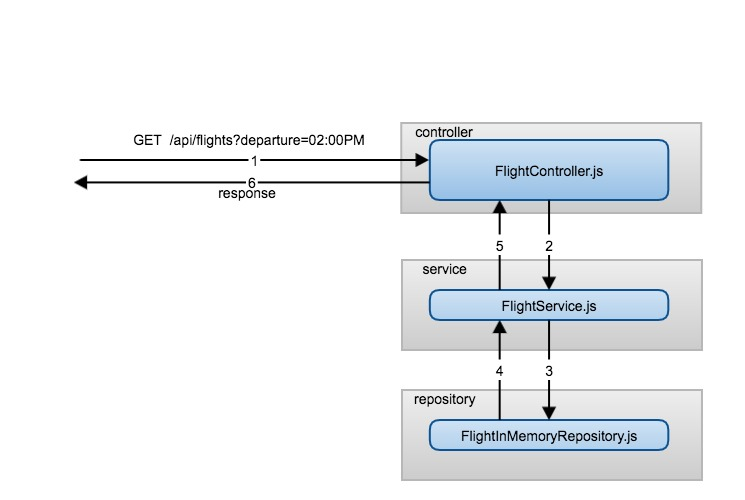

# Expedia coding Test

## General Overview
The Requirement #1: Flight Search was selected to develop a REST API using SpringBoot and Java 1.8.

### Dependencies
* Gradle 6.0.1
* Java 1.8. Please be sure to have JAVA_HOME environment variable settled down to jdk1.8.0_*. Example:
```
export JAVA_HOME=/Library/Java/JavaVirtualMachines/jdk1.8.0_192.jdk/Contents/Home 
```

### Structure
 * **controllers**: Package for all controllers. In this case FlightController, responsible for exposing the endpoint for filtering flights.
 * **dao**: Package for Data Access Object.
 * **entity**: Package with the models.
 * **exception**: Package with the custom exceptions.
 * **handler**: Package for handlers, filters. in this case RestExceptionHandler is responsible for transforming exceptions to REST responses.
 * **mapper**: Package with mappers. Mappers are used in this case to convert DTO to entity.
 * **repository**: Package with the repositories: In this case FlightInMemoryRepository is responsible for fetching data related to flights. No business logic should be here.
 * **service**: Package with the services. In this case  FlightService is responsible for applying business logic (generate the filter that meets the specified requirements).
 * **specification**: Package with the used filters. In this case FlightSpecification with the Predicates to filter by departure time.
 * **util**:  Utility classes.
 
 General flow diagram
 

## Filtering flights
The endpoint for filtering in under the URL [http://localhost:8080/api/flights?departure=DEPARTURE_DATE](http://localhost:8080/api/flights?departure=[DEPARTURE_DATE])

```
curl -X GET \
  'http://localhost:8080/api/flights?departure=[DEPARTURE_DATE]'
```
### Validations
* departure parameter is mandatory
* departure parameter should have one of the following formats:
    * hh:mmAM
    * h:mmAM
    * hh:mmPM
    * h:mmPM

## Assumptions
* When filtering flights by departure time, range [-5,5] inclusive is used.
* No overflow was used. That means if we want to filter by 02:00AM, the min range will be 00:00 hours. For the max range the max value will be 23:59. 
    
## General considerations
* No authentication/authorization was implemented so the endpoint is exposed without security.
* No logging/tracing was implemented so it would be difficult to detect any problem.
* Current repository is in memory using h2 and JPA.
* No paging/sorting was implemented.
* Data feed is in "/resources/flights.csv". DataInit.js take the information from this file and save it to an h2 database.

## Resources
* Initial Springboot app generated with: https://start.spring.io/

## Connecting to h2
After starting the app, navigate to http://localhost:8080/h2-console with the data provided in the application.properties under the fallowing properties:
```
spring.datasource.username=sa
spring.datasource.password=
spring.datasource.url=jdbc:h2:mem:flightdb
```

## Commands
* ```./gradlew bootRun```: Use this command to start the application.
* ```./gradlew test```: Use this command to run all tests.
* ```./gradlew clean build```: Use this command to clean the build directory and generate it again.


